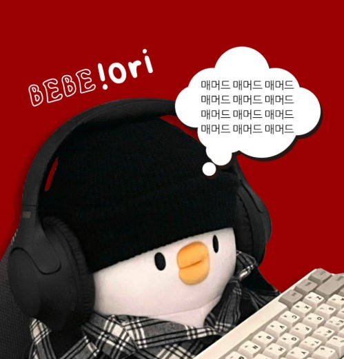

# **SKN10-3rd-1Team** 

> SK네트웍스 Family AI 캠프 10기 3차 프로젝트 
> 개발기간: 25.04.07 - 25.04.15

 

---

# 📚 Contents

1. [팀 소개](#1-introduce-team)
2. [프로젝트 개요](#2-project-overview)
3. [기술 스택 및 사용 모델](#3-technology-stack--models)
4. [시스템 아키텍처](#4-시스템-아키텍처)
6. [요구사항 명세서](#6-요구사항-명세서)
7. [수집한 데이터 및 전처리 요약](#7-수집한-데이터-및-전처리-요약)
9. [테스트 계획 및 결과 보고서](#9-테스트-계획-및-결과-보고서)
11. [수행결과(시연 페이지)](#11-수행결과시연-페이지)
13. [결론](#13-결론)
15. [한 줄 회고](#15-한-줄-회고)
 
 

---

# 1. Introduce Team

#### 💡팀명:
#### 💡프로젝트명: 삼성전자 취업 컨설팅 AI 챗봇
 

##### ⬇️팀원 소개 ⬇️

<table align="center" width="100%">
  <tr>
    <td align="center">
      <a href="https://github.com/kqe123"><b>@경규휘</b></a>
    </td>
    <td align="center">
      <a href="https://github.com/petoriko"><b>@남궁세정</b></a>
    </td>
    <td align="center">
      <a href="https://github.com/sto-lee"><b>@이종원</b></a>
    </td>
    <td align="center">
      <a href="https://github.com/yuuunong"><b>@장윤홍</b></a>
    </td>
    <td align="center">
      <a href="https://github.com/yhcho0319"><b>@조영훈</b></a>
    </td>
  </tr>
  <tr>
    <td align="center"></td>
    <td align="center"></td>
    <td align="center"></td>
    <td align="center"></td>
    <td align="center"></td>
  </tr>
</table>

---

# 2. Project Overview
### ✅ 프로젝트 소개
해당 프로젝트에서는 LLM(대형 언어 모델)을 기반으로 **삼성전자 취업 컨설팅 AI 챗봇**를 개발하였습니다.

사용자가 원하는 채용공고를 검색할 수 있고 채용 마감 전 자기소개서를 적절히 작성하였는지 피드백을 받을 수 있는 서비스 입니다.

### ✅ 프로젝트 필요성
삼성전자 등 대기업 채용은 경쟁률이 매우 높아, 맞춤형 지원 전략이 필수적입니다.

구직자들은 적합한 채용 공고를 찾기 어렵고, 자기소개서 품질에 대한 객관적 피드백을 받기 어려운 상황입니다.

기존 취업 지원 서비스는 비용 부담이 크거나 개인 맞춤형 피드백 제공에 한계가 있습니다.

이를 해결하기 위해, **LLM(대형 언어 모델)**을 활용하여 채용 정보 검색과 자기소개서 피드백을 지원하는 AI 기반 컨설팅 챗봇 개발이 필요합니다.

<table align="center">
  <tr>
    <td align="center">
      
    </td>
    <td align="center">
      
    </td>
  </tr>
</table>

### ✅ 프로젝트 목표
- 사용자가 원하는 삼성전자 채용 공고를 쉽고 빠르게 검색할 수 있도록 지원

- 사용자의 자기소개서를 분석하여 채용 전 체계적이고 구체적인 피드백 제공

### ✅ 기대 효과
- 구직자의 채용 공고 탐색 시간 절감 및 지원 전략 최적화

- 자기소개서 품질 향상으로 면접 기회 및 최종 합격률 증가

- 비용 부담 없이 전문적인 취업 컨설팅 제공 가능

- 삼성전자 외 다양한 기업으로 서비스 확장 가능성 확보

- LLM 기반 챗봇 활용 사례를 통한 AI 기술 적용 범위 확대
 

---

# 3. Technology Stack & Models

## ✅ 기술 스택 및 사용한 모델

| **Language** | **Development** | **Embedding Model** | **Vector DB** | **LLM Model** | **Framework** | **Collaboration Tool** |
|--------------|------------------|----------------------|----------------|----------------|----------------|-------------|
|  |   |   |  |  |     |    |

  

---

# 4. 시스템 아키텍처 및 플로우차트
## 아키텍쳐
📌 구성 요소  
- **Streamlit**: 웹 화면
- **LangChain**: LLM 프레임워크
- **groq**: LLM API 호출
- **tavily**: 웹 검색 Tool
- **FAISS 벡터 DB**: 의미 기반 문서 검색

  

 

## 플로우차트
📌 구성 요소 
1. **서비스 선택**
    사용자가 필요한 서비스 선택

2. **질문 입력**  
   사용자가 자연어로 질문을 입력

3. **문서 검색**  
   FAISS를 통해 자기소개서와 유사도가 높은 직무기술서 검색

4. **프롬프트 구성**  
   검색된 문서와 질문을 결합하여 하나의 입력 프롬프트로 생성

5. **모델 응답 생성**  
   LLM이 구조화된 답변을 생성

  

---

# 5. 수집한 데이터 및 전처리 요약

## ✅ 데이터 수집

## ✅ 데이터 전처리

### ✅ Fine-tuning용 데이터셋 전처리
목적: 모델이 핵심 개념과 키워드를 잘 학습할 수 있도록 불필요한 정보 제거

### ✅ RAG용 데이터셋 전처리
목적: 검색 기반 응답 정확도를 높이기 위해 실제 문서의 의미를 최대한 보존

  

---

# 6. 테스트 및 결과

### **테스트 목적**: `챗봇의 질의응답 정확도, 검색 기반 응답의 적절성(RAG) 등을 검증.`

###  ✅테스트 환경

| 항목         | 설정값                                       |
|--------------|----------------------------------------------|
| 모델         | `gemma3`                               |
| 임베딩 모델  |`OpenAIEmbeddings(model="text-embedding-3-small")`|
| 벡터 DB      | FAISS                                        |
| 외부 검색엔진| tavily                                       |
| 프레임워크   | Streamlit (Web UI)                           |

 

###  ✅테스트 시나리오 (Test Cases)

| Test ID | 목적                      | 입력 예시                               | 기대 결과                                 |
|---------|---------------------------|------------------------------------------|--------------------------------------------|
| TC01    | 유물 설명 응답 정확도     | `겨울 산수에 대해 알려줘`                | 작품명, 작가, 표현 기법 포함한 정확한 설명 |
| TC02    | 키워드 추출 능력          | `겨울 산수 작품의의 핵심 키워드는?` | "산수" 또는 "산수화" 등 핵심 개념 추출     |
| TC03    | 다국어 질의 대응 (EN)     | `Tell me about winter landscape painting`| 영어로 자연스러운 유물 설명 응답           |
| TC04    | 다국어 질의 대응 (JP)     | `冬景山水図について教えて`                | 일본어로 자연스러운 유물 설명 응답         |
| TC05    | 벡터 DB에 존재하지 않는 유물 대응   | `조선 후기 화가 김영서에 대해 알려줘` | "정보 없음" 혹은 위키피디아에서 내용 검색 후 관련 내용을 출력         |
| TC06   | 유사 질문 반복 대응       | `탑명 동판`, `염거화상 탑명 동판`         | 동일 유물에 대해 일관된 응답 제공           |
| TC07 | 이미지 URL 추출 능력 | `김수철 작품을 알려줘` | 김수철 작품에 관한 설명과 김수철 작품 URL을 함께 제공 |

 

### ✅ 결과 보고서

#### 성공 사례

| 문제 유형 | 질의 | 응답 |
|------|------|------|

 

#### ⚠️ 개선 필요 사례

| 문제 유형 | 질의 | 응답 | 문제 |
|-----------|------|------|--------|

  

### ✅ 시연 결과

 

### ✅ 출력답변

  

---

# 7. 결론

본 프로젝트에서는 LLM 기반의 다국어 도슨트 챗봇을 개발하여, 박물관 전시품에 대한 정보 접근성을 높이는 것을 목표로 진행하였습니다.
그 과정에서 다국어 입력에 유연하게 대응하고 문화적 맥락을 반영한 응답 생성을 위해 Qwen2.5-7B 모델을 최종 선정하고 파인튜닝을 수행하였으며, 외부 지식 연동(RAG), 문장 단위 청킹, 한자 및 특수문자 보존 등 다양한 전처리 전략을 적용함으로써, 질의응답 정확도와 문맥 이해도를 향상시켰습니다.
최종적으로 다양한 관람객이 박물관 유물 정보를 쉽고 자연스럽게 이해할 수 있는 실용적 도슨트 챗봇 시스템 구현하였습니다.

 

---

# 8. 회고
## 🤭경규휘
## 🙃남궁세정
## 🫡이종원
## 😊장윤홍
## 🫠조영훈