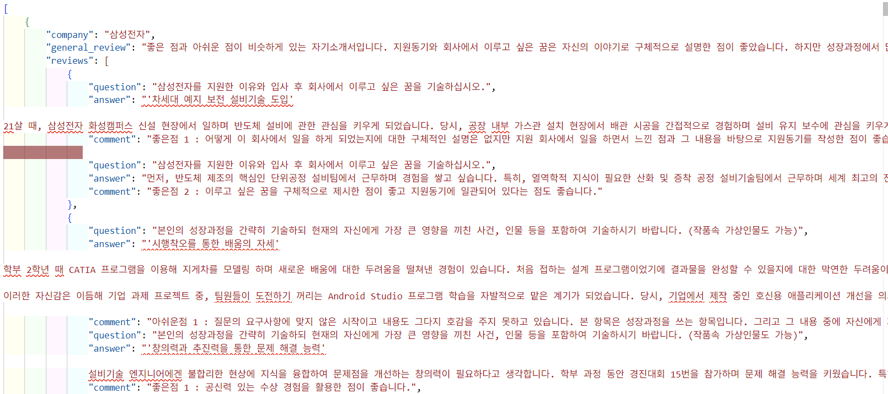
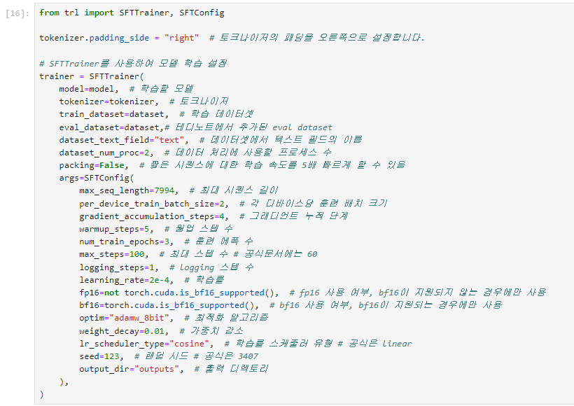
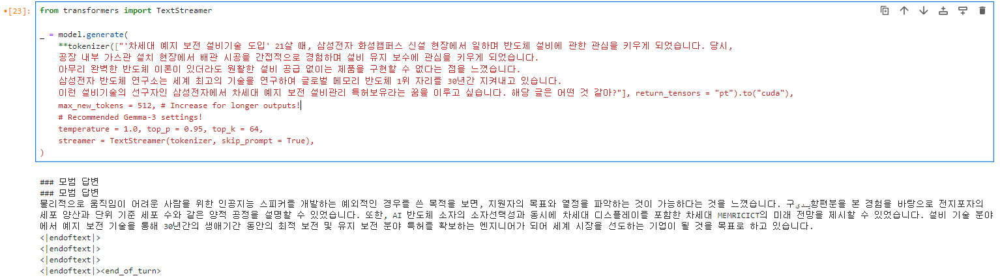
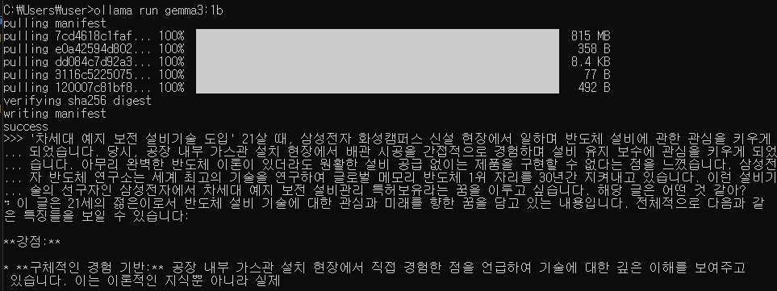

# **SKN10-3rd-1Team** 

> SK네트웍스 Family AI 캠프 10기 3차 프로젝트<br>
> 개발기간: 25.04.07 - 25.04.15

<br>

---

# 📚 Contents

1. [팀 소개](#1-introduce-team)
2. [프로젝트 개요](#2-project-overview)
3. [기술 스택 및 사용 모델](#3-technology-stack--models)
4. [시스템 아키텍처 및 플로우차트](#4-시스템-아키텍처-및-플로우차트)
5. [파인튜닝](#5-파인튜닝)
6. [RAG](#6-RAG)
7. [테스트 및 결과](#7-테스트-및-결과)
8. [결론](#8-결론)
9. [회고](#9-회고)
<br>
<br>

---

# 1. Introduce Team

#### 💡팀명:
#### 💡프로젝트명: 삼성전자 취업 컨설팅 AI 챗봇
<br>

##### ⬇️팀원 소개 ⬇️

<table align="center" width="100%">
  <tr>
    <td align="center">
      <a href="https://github.com/kqe123"><b>@경규휘</b></a>
    </td>
    <td align="center">
      <a href="https://github.com/petoriko"><b>@남궁세정</b></a>
    </td>
    <td align="center">
      <a href="https://github.com/sto-lee"><b>@이종원</b></a>
    </td>
    <td align="center">
      <a href="https://github.com/yuuunong"><b>@장윤홍</b></a>
    </td>
    <td align="center">
      <a href="https://github.com/yhcho0319"><b>@조영훈</b></a>
    </td>
  </tr>
  <tr>
    <td align="center"></td>
    <td align="center"></td>
    <td align="center"></td>
    <td align="center"></td>
    <td align="center"></td>
  </tr>
</table>

---


# 2. Project Overview
### ✅ 프로젝트 소개
해당 프로젝트에서는 LLM(대형 언어 모델)을 기반으로 **삼성전자 취업 컨설팅 AI 챗봇**를 개발하였습니다.

사용자가 원하는 채용공고를 검색할 수 있고 채용 마감 전 자기소개서를 적절히 작성하였는지 피드백을 받을 수 있는 서비스 입니다.

### ✅ 프로젝트 필요성
삼성전자 등 대기업 채용은 경쟁률이 매우 높아, 맞춤형 지원 전략이 필수적입니다.

구직자들은 적합한 채용 공고를 찾기 어렵고, 자기소개서 품질에 대한 객관적 피드백을 받기 어려운 상황입니다.

기존 취업 지원 서비스는 비용 부담이 크거나 개인 맞춤형 피드백 제공에 한계가 있습니다.

이를 해결하기 위해, **LLM(대형 언어 모델)**을 활용하여 채용 정보 검색과 자기소개서 피드백을 지원하는 AI 기반 컨설팅 챗봇 개발이 필요합니다.

<table align="center">
  <tr>
    <td align="center">
      
    </td>
    <td align="center">
      
    </td>
  </tr>
</table>

### ✅ 프로젝트 목표
- 사용자가 원하는 삼성전자 채용 공고를 쉽고 빠르게 검색할 수 있도록 지원

- 사용자의 자기소개서를 분석하여 채용 전 체계적이고 구체적인 피드백 제공

### ✅ 기대 효과
- 구직자의 채용 공고 탐색 시간 절감 및 지원 전략 최적화

- 자기소개서 품질 향상으로 면접 기회 및 최종 합격률 증가

- 비용 부담 없이 전문적인 취업 컨설팅 제공 가능

- 삼성전자 외 다양한 기업으로 서비스 확장 가능성 확보

- LLM 기반 챗봇 활용 사례를 통한 AI 기술 적용 범위 확대
<br>

---

# 3. Technology Stack & Models

## ✅ 기술 스택 및 사용한 모델


| **Language** | **Development** | **Embedding Model** | **Vector DB** | **LLM Model** | **Framework** | **Collaboration Tool** |
|--------------|------------------|----------------------|----------------|----------------|----------------|-------------|
|  | <br> | <br> |  |  |  <br>  | <br><br> |


<br><br>

---

# 4. 시스템 아키텍처 및 플로우차트
## 아키텍쳐
📌 구성 요소  
- **Streamlit**: 웹 화면
- **LangChain**: LLM 프레임워크
- **groq**: LLM API 호출
- **tavily**: 웹 검색 Tool
- **FAISS 벡터 DB**: 의미 기반 문서 검색

<div align="center">
  
</div>

<br>

## 플로우차트
📌 구성 요소 
1. **서비스 선택**
    사용자가 필요한 서비스 선택

2. **질문 입력**  
   사용자가 자연어로 질문을 입력

3. **문서 검색**  
   FAISS를 통해 자기소개서와 유사도가 높은 직무기술서 검색

4. **프롬프트 구성**  
   검색된 문서와 질문을 결합하여 하나의 입력 프롬프트로 생성

5. **모델 응답 생성**  
   LLM이 구조화된 답변을 생성

<div align="center">
  
</div>

---

# 5. 파인튜닝
### ✅데이터 수집
  SFT 파인튜닝을 위해 잡코리아 삼성전자 합격자소서 데이터 수집을 목표 (https://www.jobkorea.co.kr/starter/PassAssay?schPart=&schWork=&schEduLevel=&schCType=&schGroup=&isSaved=0&isFilterChecked=0&Pass_An_Stat=1&OrderBy=0&schTxt=%EC%82%BC%EC%84%B1%EC%A0%84%EC%9E%90)   

  아래의 형식에 맞춰 데이터를 학습하고 자 하였음
  ```json
  {
      "company": "삼성전자", # 회사 명
      "general_review": "", # 전문가 총평
      "reviews": [ # 자소서 문항, 내용 그리고 전문가 피드백
          {
              "question": "삼성전자를 지원한 이유와 입사 후 회사에서 이루고 싶은 꿈을 기술하십시오.",
              "answer": "",
              "comment": ""
          },
          {
              "question": "본인의 성장과정을 간략히 기술하되 현재의 자신에게 가장 큰 영향을 끼친 사건, 인물 등을 포함하여 기술하시기 바랍니다. (작품속 가상인물도 가능)",
              "answer": "",
              "comment": ""
          },
          {
              "question": "최근 사회 이슈 중 중요하다고 생각되는 한 가지를 선택하고 이에 관한 자신의 견해를 기술해 주시기 바랍니다.",
              "answer": "",
              "comment": "",
          },
          {
              "question": "지원 직무에 대해 본인이 이해한 내용을 서술하고, 본인이 해당 직무에 적합한 사유를 전공능력 측면에서 구체적으로 서술해 주시기 바랍니다.",
              "answer": "",
              "comment": "",
          },
      ]
  }
  ```

  기대 효과
  > 자소서와 피드백 데이터에 대해 SFT를 통하여 모델이 전문가처럼 자소서를 평가할 수 있기를 기대

  <br>

  1. **직면한 문제**   
  잡코리아는 크롤링에 대해 우호적이지 않아 python 크롤링 라이브러리인 beautifulsoup, selenium을 사용해보았지만 제대로 데이터가 수집되지 않았음.
  그래서 직접 데이터를 손 크롤링을 하여 시간이 오래 걸리고 모델 학습에 용이하게 학습한다는 관점에서 벗어난 수집을 위한 수집을 하게 됨
      >초기 수집된 데이터
      
  
  2. **해결하고자 노력**   
  수작업으로 크롤링을 했던만큼 학습에 용이하도록 수정하는 리소스도 비슷하게 필요할 것이라 판단하여 수행해보았지만, json파일의 구조적인 문제로 리소스가 너무나 많이 필요했음
      >이상적인 학습 데이터 구조
      

  3. **중간 결과**   
  해결하고자 노력하는 과정에서 얻어진 학습 데이터로 SFT를 수행해보았더니 base model인 gemma3:1b보다 적절하지 못한 답변이 나오는 것을 확인했음
      >**SFT Config**
      
      **gemma3:1b SFT 결과**
      
      **gemma3:1b 결과**
      

---

# 6. RAG
### ✅데이터 수집
1. 삼성전자 직무기술서 데이터 수집 (https://community.linkareer.com/employment_data/3367812)
2. pdf 로드
3. 600자 단위로 텍스트 청크 분할
4. OpenAIEmbeddings(model="text-embedding-3-small")로 텍스트 벡터화
5. Faiss 벡터DB 생성

**기대효과**
> 직무에 부합하는 피드백을 제공하고 채용 공고 및 직무 요구사항과의 정합성을 높인 답변을 생성


<br><br>

---

# 7. 테스트 및 결과
### ✅ 시연 결과

<br><br>

---

# 8. 결론

본 프로젝트를 통해 LLM 기반 삼성전자 취업 컨설팅 AI 챗봇을 개발할 수 있었습니다.

구직자들은 챗봇을 활용하여 원하는 채용 공고를 빠르게 찾고, 자기소개서에 대한 체계적이고 구체적인 피드백을 받아 지원 준비를 더욱 효율적으로 진행할 수 있었습니다.

특히, 직무기술서를 기반으로 한 RAG(Retrieval-Augmented Generation) 기법을 도입하여 사용자가 입력한 내용에 대해 보다 정확하고 직무에 부합하는 피드백을 제공하고 채용 공고 및 직무 요구사항과의 정합성을 높인 답변을 생성할 수 있었습니다.

또한, 본 프로젝트는 AI를 활용한 개인 맞춤형 취업 지원 서비스의 가능성을 보여주었으며, 향후 삼성전자를 넘어 다양한 기업 및 산업 분야로의 확장 가능성을 확보하는 기반을 마련했습니다.

향후에는 지속적인 데이터 고도화와 모델 개선을 통해, 더 많은 구직자들이 효율적이고 성공적인 취업 활동을 할 수 있도록 지원할 예정입니다.


<br>

---


# 9. 회고
## 🤭경규휘
웹을 구현하는 역할이라서 LLM을 구현하는 것보다 더 쉽게 할 수 있었다고 생각합니다. 그리고 팀장님이 잘 이끌어주신 덕분에 목표를 순조롭게 달성할 수 있었다 생각합니다.
## 🙃남궁세정
이번 프로젝트는 정말 GPT랑 많이 협업해서 했는데
gpt랑 처음에는 혼자서 뭔가 만들려고 삼성채용사이트 웹크롤링을 시도했다가 
다 망해갔다가 겨우 직무명이랑 전화번호 따는데는 성공하는데 
그 나머지는 전혀 웹크롤링이 안되서 포기했고 
그 다음은 맡은 일을 단계를 처음부터 정의부터 시작해서 
같이 단계를 밟아서 서로 대화해서 
비교적 전에 프로젝트보다는 덜 당황한 것 같습니다.
다 실패한 것 투성이에다가 서로 머리가 멍해져서..
하 왜 안되지라고 GPT랑 한숨을 여러번 쉬었죠...특히 크롤링하면서요...
그리고 이번에는 정말..머리가 멍해져서...기억도 날라가고...
좀 멍한 것 같은 느낌을 많이 받았습니다...
이번 프로젝트는 정말 팀원분들과 팀장님이 많이 고생해주셔서 완성된거고 
정말 정말 팀원분들과 팀장님께 감사합니다...정말 정말 수고하셨습니다..
그리고 저번 프로젝트에서 제가 많이 실수한 거는 이번에는 없어서 다행이에요...
## 🫡이종원
팀장님 정말 수고 많으셨습니다
## 😊장윤홍
일을 병렬적으로 수행하기 위해 아키텍쳐와 플로우차트를 설게하는 것에 많은 노력을 들였던것 같습니다. 하지만 먼저 선행되어야 하는 업무가 존재하였고 선행업무가 계획일정대로 완료 못하였을 때의 대처를 잘 하지 못하였던 것 같습니다. 이번 프로젝트로 이러한 일이 발생하였을 때를 대비한 계획이 존재해야 한다는 것을 알게 되었습니다.
## 🫠조영훈
코드를 사용해서 데이터를 크롤링 하려했지만 사이트에서 막아서 데이터 수집을 못했습니다. 그래서 직접 데이터를 수집했는데 그 과정이 생각보다 오래 걸려서 힘든 부분도 있었습니다. 그래서 더 쉬운 방법이 없을지에 대해 생각하던 중 캡처해서 이미지를 통한 크롤링이 가능하면 좋을 것 같다는 생각을 했습니다.