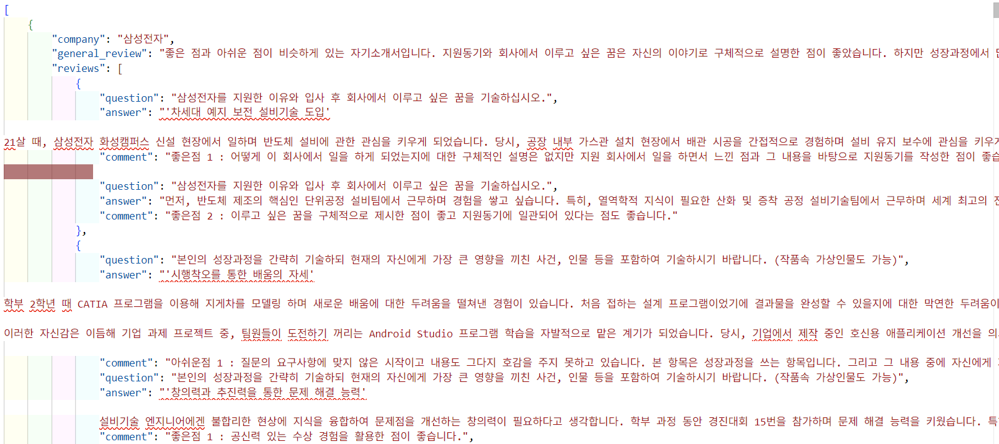
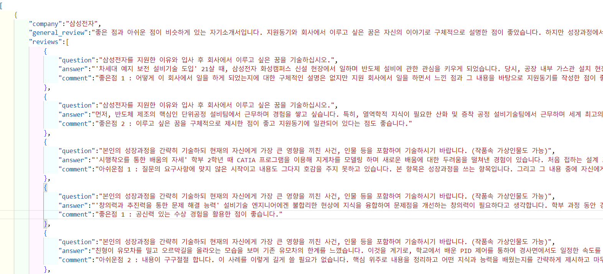
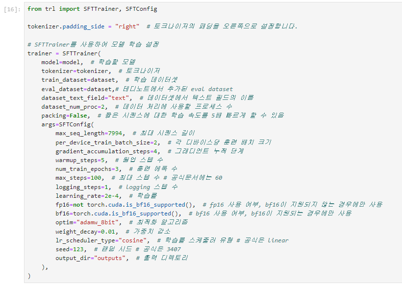
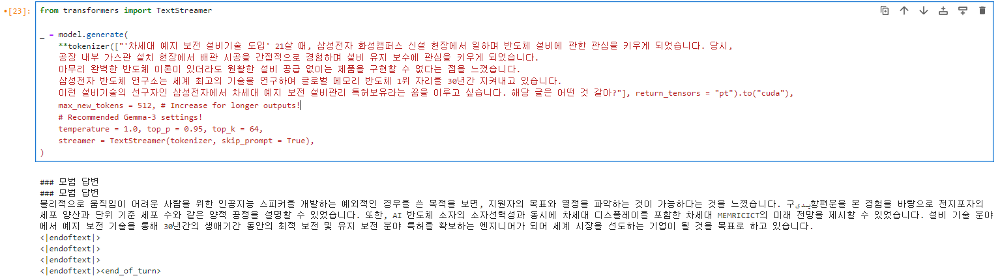
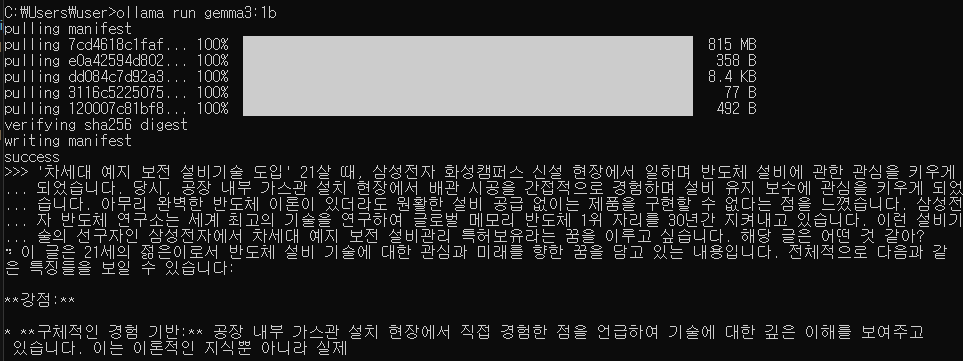

5. 데이터 수집
    - 파인튜닝   
    SFT 파인튜닝을 위해해 잡코리아 삼성전자 합격자소서 데이터 수집을 목표 (https://www.jobkorea.co.kr/starter/PassAssay?schPart=&schWork=&schEduLevel=&schCType=&schGroup=&isSaved=0&isFilterChecked=0&Pass_An_Stat=1&OrderBy=0&schTxt=%EC%82%BC%EC%84%B1%EC%A0%84%EC%9E%90)   

    아래의 형식에 맞춰 데이터를 학습하고 자 하였음
    ```json
    {
        "company": "삼성전자", # 회사 명
        "general_review": "", # 전문가 총평
        "reviews": [ # 자소서 문항, 내용 그리고 전문가 피드백백
            {
                "question": "삼성전자를 지원한 이유와 입사 후 회사에서 이루고 싶은 꿈을 기술하십시오.",
                "answer": "",
                "comment": ""
            },
            {
                "question": "본인의 성장과정을 간략히 기술하되 현재의 자신에게 가장 큰 영향을 끼친 사건, 인물 등을 포함하여 기술하시기 바랍니다. (작품속 가상인물도 가능)",
                "answer": "",
                "comment": ""
            },
            {
                "question": "최근 사회 이슈 중 중요하다고 생각되는 한 가지를 선택하고 이에 관한 자신의 견해를 기술해 주시기 바랍니다.",
                "answer": "",
                "comment": "",
            },
            {
                "question": "지원 직무에 대해 본인이 이해한 내용을 서술하고, 본인이 해당 직무에 적합한 사유를 전공능력 측면에서 구체적으로 서술해 주시기 바랍니다.",
                "answer": "",
                "comment": "",
            },
        ]
    }
    ```

    기대 효과
    > 자소서와 피드백 데이터에 대해 SFT를 통하여 모델이 전문가처럼 자소서를 평가할 수 있기를 기대

6. 테스트 및 결과
    - 파인튜닝   
    1. **직면한 문제**   
    잡코리아는 크롤링에 대해 우호적이지 않아 python 크롤링 라이브러리인 beautifulsoup, selenium을 사용해보았지만 제대로 데이터가 수집되지 않았음.
    그래서 직접 데이터를 손 크롤링을 하여 시간이 오래 걸리고 모델 학습에 용이하게 학습한다는 관점에서 벗어난 수집을 위한 수집을 하게 됨
        >초기 수집된 데이터터
        
    
    2. **해결하고자 노력**   
    수작업으로 크롤링을 했던만큼 학습에 용이하도록 수정하는 리소스도 비슷하게 필요할 것이라 판단하여 수행해보았지만, json파일의 구조적인 문제로 리소스가 너무나 많이 필요했음
        >이상적인 학습 데이터 구조
        

    3. **중간 결과**   
    해결하고자 노력하는 과정에서 얻어진 학습 데이터로 SFT를 수행해보았더니 base model인 gemma3:1b보다 적절하지 못한 답변이 나오는 것을 확인했음
        >**SFT Config**
        
        **gemma3:1b SFT 결과**
        
        **gemma3:1b 결과**
        
    